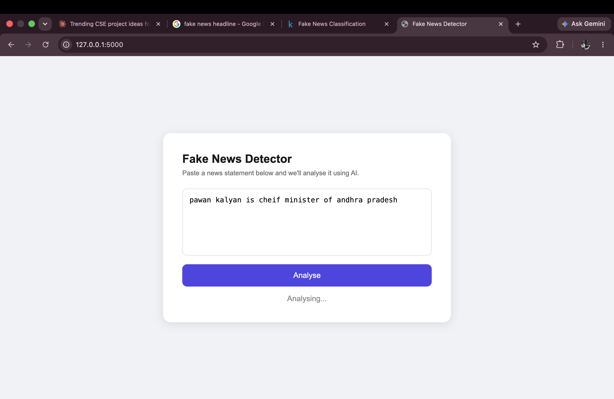
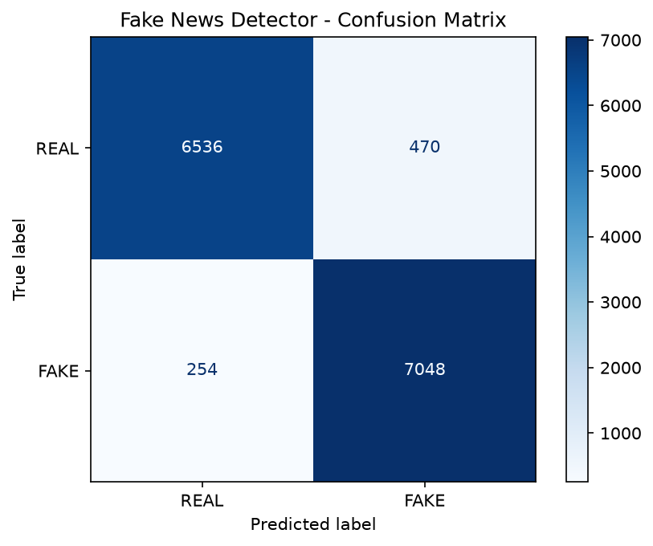

# Fake News Detector

An AI-powered web app that detects fake news using Machine Learning built from scratch.

## Live Demo
🔗 Coming soon after deployment

## Screenshots

## How It Works
This project uses **TF-IDF (Term Frequency-Inverse Document Frequency)** to convert news text into numbers that a machine learning model can understand.

- **TF (Term Frequency):** How often a word appears in a news article
- **IDF (Inverse Document Frequency):** How rare that word is across all articles
- Words that appear frequently in fake news (like "BREAKING", "UNBELIEVABLE") get high scores
- A **Logistic Regression** model then classifies the article as REAL or FAKE based on these scores

## Model Performance
- ✅ Accuracy: 94.94%
- ✅ Precision: 95% (REAL), 94% (FAKE)
- ✅ Recall: 93% (REAL), 97% (FAKE)
- ✅ Trained on 72,134 real world news articles

## Confusion Matrix

## Tech Stack
- Python, Scikit-learn, Flask
- TF-IDF Vectorizer (5000 features)
- Logistic Regression
- WELFake Dataset (72,134 articles)

## How to Run Locally
1. Clone the repo
2. Create virtual environment
3. Install dependencies
4. Download WELFake dataset from Kaggle
Place `WELFake_Dataset.csv` in the root folder

5. Train the model

6. Run the app
7. Open `http://127.0.0.1:5000`
